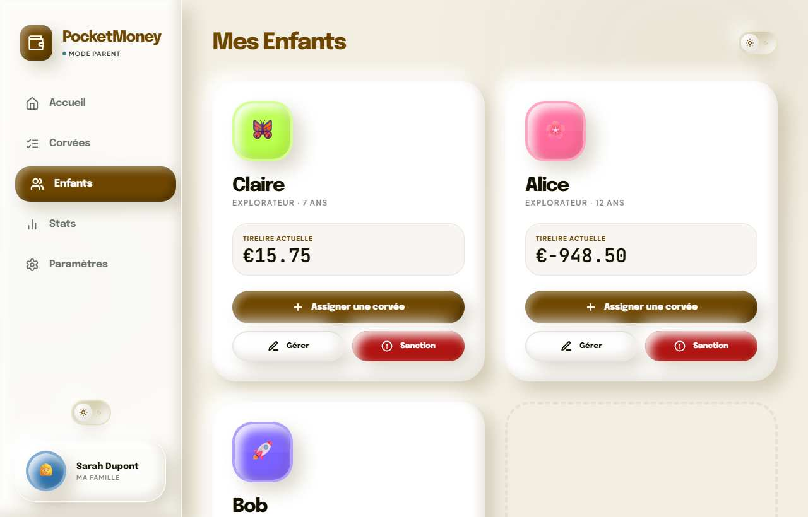
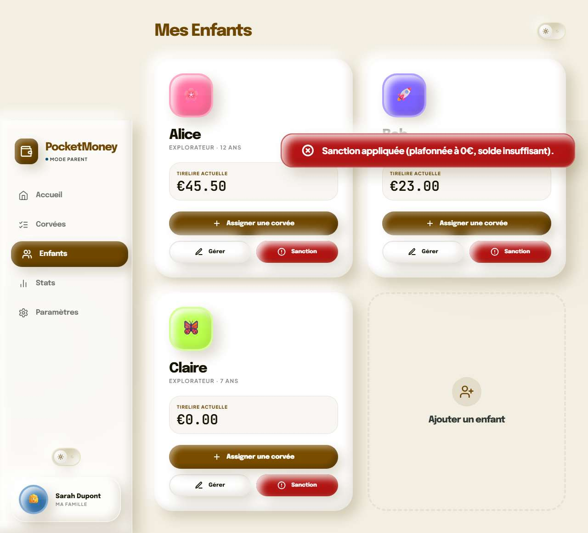
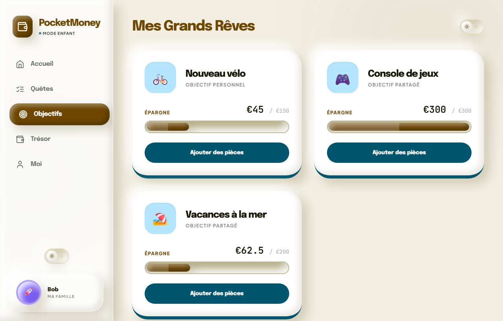
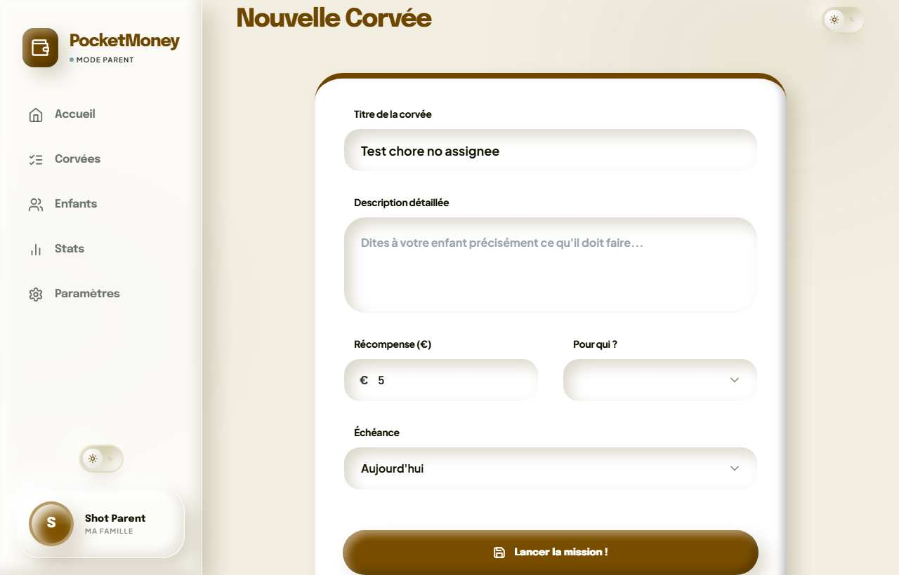
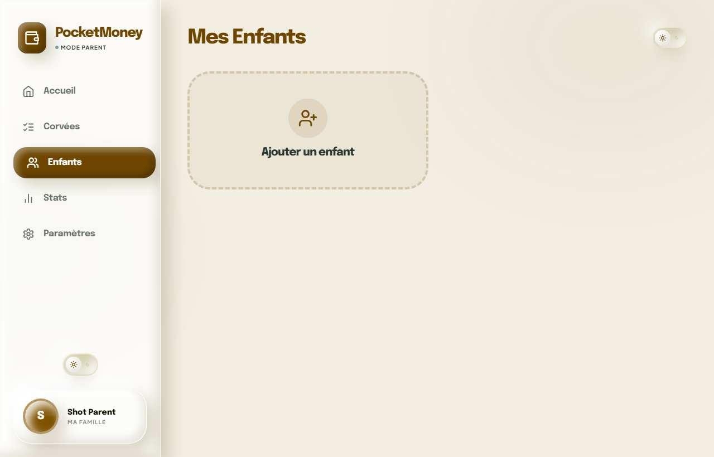
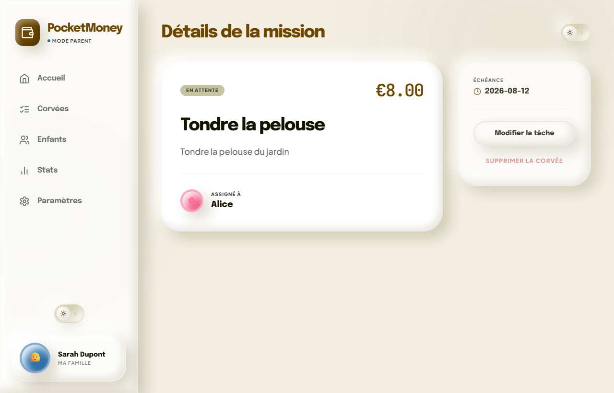
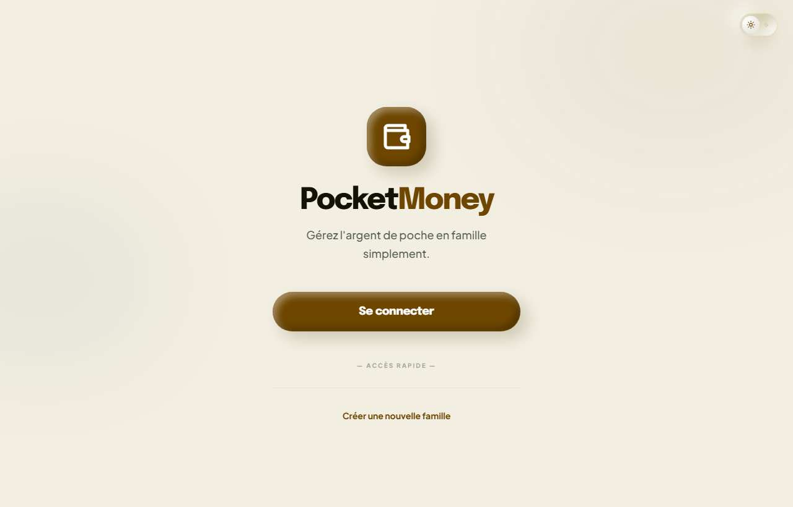
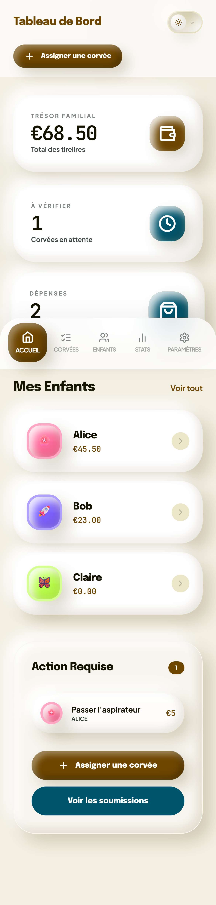
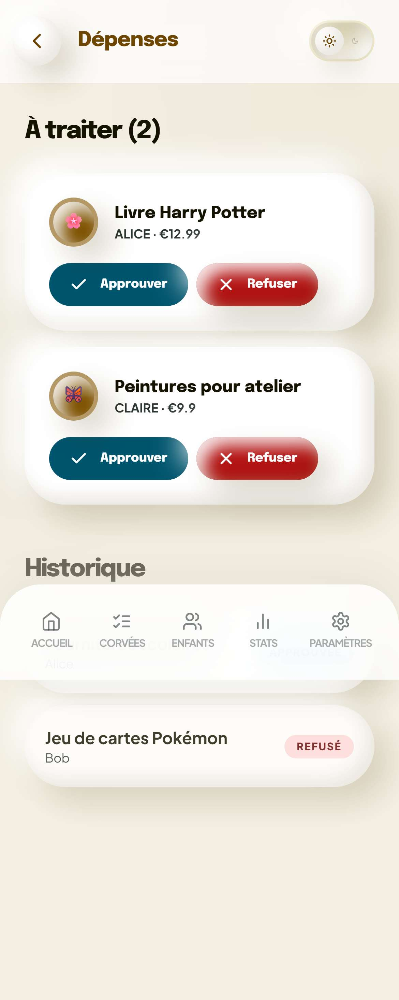
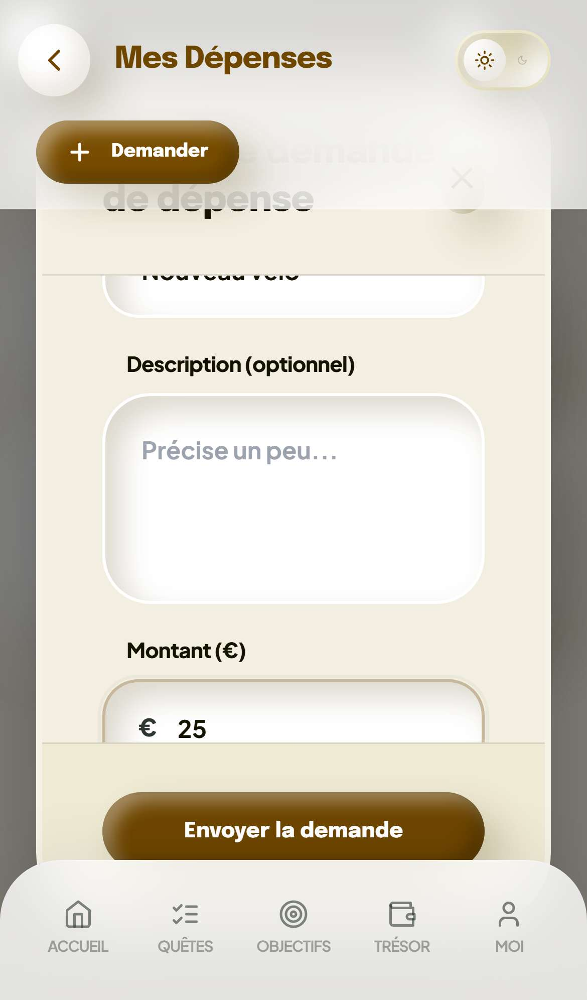

# Rapport de bugs — PocketMoney

Testé en local : backend Express+Prisma sur PostgreSQL, frontend Vite.
Desktop 1440×900 et mobile (émulation iPhone 13, portrait + paysage) via
Playwright/Chromium. Compte de démo utilisé : `sarah@dupont.fr` / `password123`
(parent) et `Alice` / `Bob` / `Claire` / `password123` (enfants).

**Statut global (5 août 2026, second passage) : les 17 anomalies ci-dessous
ont été corrigées et re-vérifiées par un script Playwright automatisé
(19/19 vérifications passées, 0 erreur console).** Une 18e anomalie
(`MODAL-1`) a été découverte *pendant* la correction et corrigée elle aussi.

Légende sévérité : 🔴 Critique · 🟠 Élevée · 🟡 Moyenne · ⚪ Mineure/cosmétique

---

## 🔴 [ENV-1] Le backend est cassé au premier appel réel — incohérence Postgres/SQLite

**Statut : Corrigé.**

`backend/prisma/schema.prisma` déclare `provider = "postgresql"`, mais :
- `backend/.env` fournissait `DATABASE_URL="file:./dev.db"` (format SQLite)
- `docker-compose.yml` fournit `DATABASE_URL: file:/app/data/prod.db` (idem)
- l'historique de migrations (`backend/prisma/migrations/`) était généré en
  dialecte SQLite (`migration_lock.toml` → `provider = "sqlite"`)

Résultat : **tout** appel touchant la base (inscription, connexion, corvées,
objectifs, règles…) échouait avec :
```
error: Error validating datasource `db`: the URL must start with the
protocol `postgresql://` or `postgres://`.
```

**Correctif :**
- Régénération d'un historique de migrations Postgres
  (`backend/prisma/migrations/20260805195807_init_postgres/`).
- `docker-compose.yml` : ajout d'un service `db` (Postgres 16) avec
  `healthcheck`, et `DATABASE_URL` de `app` pointant vers ce service
  (`postgresql://pocketmoney:...@db:5432/pocketmoney`) au lieu d'un fichier.
- `backend/.env.example` mis à jour avec une URL Postgres d'exemple.
- `backend/.env` local (non versionné) : à pointer vers une instance Postgres
  réelle — voir la section Environnement en pied de rapport pour la commande
  utilisée pendant les tests.

---

## 🔴 [MONEY-1] Le solde d'un enfant peut devenir profondément négatif via une sanction

**Statut : Corrigé.**

`backend/PLAN.md` énonce sa propre "règle d'or" : *"La balance d'un enfant ne
peut jamais descendre en dessous de 0€"*. Cette règle n'était vérifiée que sur
`POST /api/goals/:id/fund` — pas sur les sanctions ni les dépenses.

**Reproduit avant correctif** : règle "QA Big Fine" à 999 € appliquée à Alice
(solde 50,50 €) → solde passé à **-948,50 €**, trésor familial du tableau de
bord passé à **-906,75 €**.



**Correctif :** `POST /api/rules/:id/apply`, `PUT /api/expenses/:id/approve`
et `POST /api/expenses/deduct` utilisent maintenant une transaction Prisma
interactive (`clampedDeduct`) qui plafonne toute déduction à ce que l'enfant
possède réellement, et enregistre le montant *effectivement* déduit dans la
transaction — pas le montant demandé. Le parent reçoit un toast
"plafonnée à 0€, solde insuffisant" quand un plafonnage a eu lieu.

**Re-vérifié** : une sanction de 999 € appliquée à un enfant à faible solde
laisse désormais le solde exactement à **0**, jamais en dessous (`min balance
across children = 0` sur les 3 enfants après le test).



---

## 🔴 [MONEY-3] Un enfant pouvait se créditer de l'argent en entrant un montant négatif

**Statut : Corrigé.**

L'action "Ajouter des pièces" utilisait `window.prompt()` sans validation, et
`POST /api/goals/:id/fund` faisait `parseFloat(amount)` sans vérifier le
signe.

**Reproduit avant correctif** (Bob, objectif "Vacances à la mer") : saisie de
`-5` → solde de Bob passé de 21,00 € à **26,00 €** (au lieu de baisser),
objectif familial passé de 67,50 € à 62,50 €.

**Correctif :** validation `amount > 0` ajoutée côté serveur (`fund`,
`withdraw`, `deduct`, approbation de dépense) **et** côté client
(`fundGoal`/`withdrawFromGoal` dans `context.jsx` rejettent tout montant
≤ 0 avant même l'appel réseau, avec un toast d'erreur).

**Re-vérifié** : saisir `-5` dans la popup ne change plus le solde de Bob
(`before=23 after=23`).

---

## 🔴 [MONEY-2] Un enfant voyait et pouvait financer l'objectif personnel d'un autre enfant

**Statut : Corrigé.**

`GoalsScreen` affichait tous les objectifs de la famille sans filtrer sur la
participation ni le caractère partagé, et l'API n'avait aucun contrôle de
propriété.

**Reproduit avant correctif** : connecté en Bob, l'objectif personnel
d'Alice ("Nouveau vélo", non partagé) était visible et finançable.



**Correctif :** `GET /api/goals` ne renvoie plus, pour un enfant, que les
objectifs partagés (`isShared: true`) ou ceux où il participe déjà. `POST
/api/goals/:id/fund` (et le nouveau `/withdraw`) vérifient en plus que
l'objectif appartient à la famille de l'appelant et — pour un objectif non
partagé — que l'appelant en est déjà participant, sinon `403`.

**Re-vérifié** : Bob ne voit plus que `["Vacances à la mer", "Console de
jeux"]`, "Nouveau vélo" n'apparaît plus dans sa liste.

---

## 🟠 [CHORE-1] Créer une corvée sans enfant dans la famille échouait silencieusement

**Statut : Corrigé.**

Avec 0 enfant dans la famille, remplir le formulaire de corvée et cliquer
"Lancer la mission !" ne faisait rien, sans aucun message.



**Correctif :** `CreateChore` détecte maintenant `children.length === 0` et
affiche un état vide explicite ("Ajoutez d'abord un enfant") avec un bouton
direct vers le code d'invitation dans les Paramètres, au lieu d'afficher un
formulaire inutilisable.

**Re-vérifié** : le message "Ajoutez d'abord un enfant" s'affiche bien à la
place du formulaire.


---

## 🟠 [UI-1] Le bouton "Ajouter un enfant" ne faisait rien

**Statut : Corrigé.**

`ChildrenView` avait un handler vide (`onClick={() => {}}`).



**Correctif :** le bouton affiche désormais un toast expliquant qu'il faut
partager le code d'invitation, puis navigue vers Paramètres où ce code est
affiché.

**Re-vérifié** : le clic amène bien sur `/parent/settings`.

---

## 🟠 [UI-2] "Modifier la tâche" et "Supprimer la corvée" ne faisaient rien

**Statut : Corrigé.**

Aucun des deux boutons n'avait de `onClick`.



**Correctif :**
- Backend : ajout de `PATCH /api/chores/:id` (édition) et `DELETE
  /api/chores/:id` (suppression), réservés au parent.
- Frontend : "Modifier la tâche" ouvre un vrai formulaire d'édition
  (réutilise l'écran de création, pré-rempli, route
  `/parent/chores/:id/edit`) ; "Supprimer la corvée" demande confirmation
  puis supprime réellement la corvée.

**Re-vérifié** : édition d'une corvée ("Chore to edit" → "Chore edited!")
persiste bien après rechargement ; suppression fait disparaître la corvée de
la liste.

---

## 🟠 [UI-3] La connexion enfant en un clic ("Accès Rapide") ne s'affichait jamais

**Statut : Corrigé — avec un correctif de sécurité en plus.**

L'écran d'accueil affiche des avatars enfants pour un accès rapide, mais
`family` n'est peuplé qu'après connexion — cet écran ne s'affichant que
lorsque personne n'est connecté, le bloc restait vide en permanence.



**Point de sécurité découvert en corrigeant :** le handler `loginAsChild`
associé à ces boutons faisait simplement `setUser(child)` **sans jamais
vérifier de mot de passe** — aucun token, aucune authentification réelle. Le
bug UI masquait involontairement un contournement total de l'authentification
: le rendre "fonctionnel" tel quel aurait permis à n'importe quel visiteur de
se faire passer pour n'importe quel enfant d'un simple clic.

**Correctif :**
- Le nom de famille (avatars enfants) est maintenant mis en cache dans
  `localStorage` à chaque connexion réussie, pour rester disponible sur
  l'écran d'accueil même déconnecté.
- Les boutons "Accès Rapide" **pré-remplissent le formulaire de connexion**
  avec le prénom de l'enfant au lieu de contourner l'authentification —
  l'enfant n'a plus qu'à taper son mot de passe.
- `loginAsChild` (le contournement) a été supprimé du code.

**Re-vérifié** : après une première connexion, les avatars apparaissent bien
sur l'écran d'accueil ; cliquer dessus amène sur `/login` avec le prénom
pré-rempli — pas de connexion automatique.

---

## 🟡 [LAYOUT-1] Titre d'écran tronqué sur mobile sur (quasiment) tous les écrans parent

**Statut : Corrigé.**

Sur 390px, "Tableau de Bord" devenait **"Tab…"**, "Mes Corvées" devenait
**"Mes Corvé…"**, l'en-tête combinant titre + bouton d'action + interrupteur
de thème sur une seule ligne sans repli responsive.


**Correctif :** l'en-tête mobile (`Layout`) est désormais sur deux lignes
quand une action existe : titre + retour + thème sur la première ligne
(le titre a toute la place), l'action (`headerRight`) sur une seconde ligne
en dessous.

**Re-vérifié** : "Tableau de Bord" et "Mes Corvées" s'affichent en entier sur
iPhone 13 (390px), aucun débordement horizontal introduit (0px).



---

## 🟡 [FEATURE-1] La gestion des dépenses existait côté API mais n'avait aucune interface

**Statut : Corrigé.**

`expensesAPI` existait dans `api.js` mais n'était utilisé nulle part.

**Correctif :** nouvel écran enfant `/child/expenses` (liste + formulaire de
demande : titre, montant, type, référence) et nouvel écran parent
`/parent/expenses` (file d'attente + approbation avec montant ajustable +
refus avec motif), tous deux branchés sur `context.jsx`
(`requestExpense`/`approveExpense`/`rejectExpense`). Accès depuis le profil
enfant et depuis une nouvelle StatCard "Dépenses" du tableau de bord parent
(qui remplace au passage le faux "Performance : 92 %", voir COSMETIC-1).

**Re-vérifié** : une demande créée par Alice ("Stylo magique", 10 €)
apparaît côté parent, l'approbation déduit bien 10 € du solde d'Alice.




---

## 🟡 [FEATURE-2] `withdrawGoal` / `buyGoal` appelaient des routes backend inexistantes

**Statut : Corrigé.**

**Correctif :** implémentation de `POST /api/goals/:id/withdraw` (retourne de
l'argent de l'objectif vers le solde, plafonné à ce qui a été épargné) et
`PUT /api/goals/:id/buy` (marque un objectif atteint comme acheté). Un
bouton "Retirer" a été ajouté à côté de "Ajouter des pièces" sur l'écran
Objectifs enfant.

**Re-vérifié** : épargner 5 € puis les retirer ramène le solde exactement à
sa valeur de départ.

---

## 🟡 [MONEY-4] Aucun garde-fou contre un montant de sanction négatif à la création

**Statut : Corrigé.**

`min="0"` sur le champ montant n'était qu'un indice visuel HTML, pas un
blocage réel.

**Correctif :** `updateRules` (`context.jsx`) plafonne désormais tout montant
à 0 avant l'envoi (`Math.max(0, parseFloat(r.amount) || 0)`), et `PUT
/api/family/rules` fait de même côté serveur — y compris à la création de
famille (règles initiales).

---

## ⚪ [COSMETIC-1] Statistique "Performance : 92 %" figée en dur

**Statut : Corrigé.** Remplacée par une vraie StatCard "Dépenses" (nombre de
demandes en attente, cliquable vers `/parent/expenses`) — voir FEATURE-1.

---

## ⚪ [COSMETIC-2] Badge "+€12.50 ce mois" figé en dur

**Statut : Corrigé.** Le champ `monthDelta` (déjà en base, jamais exposé par
l'API) est maintenant renvoyé par `/api/auth/me`, `/login` et les routes
d'inscription, et le tableau de bord enfant affiche la vraie valeur (masquée
si `monthDelta` vaut 0).

---

## ⚪ [COSMETIC-3] Avertissement React (DOM invalide) sur l'écran de soumission de corvée

**Statut : Corrigé.** Le `<p>` qui enveloppait un `<div>` (icône + libellé
"Preuve en image") dans `SubmitChore` a été changé en `<div>`.
**Re-vérifié** : plus aucune erreur/warning console sur l'ensemble du parcours
testé (desktop + mobile).

---

## ⚪ [COSMETIC-4] Écran Statistiques 100 % statique

**Statut : non corrigé — hors périmètre.** Le texte "Vos données arrivent !"
est un message "bientôt disponible" volontaire, pas un bug d'affichage ; y
mettre de vrais graphiques est une fonctionnalité à part entière (choix des
métriques, agrégations, période) plutôt qu'un correctif de bug. Laissé tel
quel ; à traiter comme une demande de fonctionnalité si souhaité.

---

## 🟠 [MODAL-1] Découvert pendant la correction — une modale trop haute rend son bouton de validation inatteignable sur mobile

**Statut : Corrigé.**

En branchant le nouveau formulaire "Demander une dépense" (5 champs) dans la
modale partagée (`Modal`, `ui.jsx`), le bouton "Envoyer la demande" du pied de
modale s'est retrouvé hors écran sur iPhone 13 (390×844) — sans aucun moyen
de scroller jusqu'à lui, car la modale elle-même n'avait pas de hauteur
maximale (seul son contenu interne avait `overflow-y-auto`, mais le
conteneur pouvait grandir indéfiniment). Ce défaut préexistait dans le
composant partagé et aurait affecté toute modale à contenu un peu long sur
petit écran (potentiellement déjà la modale de sanction avec beaucoup de
règles).

**Correctif :** ajout de `max-h-[85vh]` sur le conteneur de la modale — le
contenu interne scrolle désormais correctement à l'intérieur, header et
footer restent toujours visibles et atteignables.

**Re-vérifié** : le parcours complet "ouvrir la modale → remplir 5 champs →
cliquer Envoyer" fonctionne de bout en bout sur iPhone 13.

---

## Ce qui fonctionnait déjà correctement (inchangé)

- Inscription parent (création de famille + étape règles), inscription
  parent (rejoindre via code), inscription enfant (via code).
- Connexion par email (parent) et par prénom (enfant, pas d'email).
- Cycle de vie complet d'une corvée : soumission → validation → transaction
  → solde crédité → confetti.
- Sanction à montant raisonnable : solde correctement débité.
- Code d'invitation affiché et copiable dans Paramètres.
- Mobile : pas de débordement horizontal, bottom nav en dessous du
  breakpoint `lg:`.

---

## Environnement utilisé pour les deux passages (test puis correction)

Un cluster PostgreSQL 18 jetable a été démarré localement pour les tests
(le service Postgres système nécessitait un mot de passe non disponible) :

```bash
initdb -D <dossier> -U postgres -A trust -E UTF8 --locale=C
pg_ctl -D <dossier> -o "-p 5433 -c listen_addresses=127.0.0.1" start
createdb -h 127.0.0.1 -p 5433 -U postgres pocketmoney_qa
```

`backend/.env` (local, non versionné) :
```
DATABASE_URL="postgresql://postgres@127.0.0.1:5433/pocketmoney_qa"
```

Pour du développement durable, préférer un vrai rôle/mot de passe (ou
`docker compose up db`, maintenant que le service Postgres a été ajouté —
voir ENV-1) plutôt que ce cluster jetable en mode `trust`.
